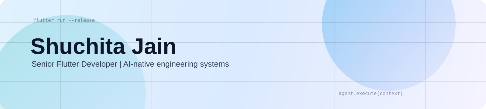
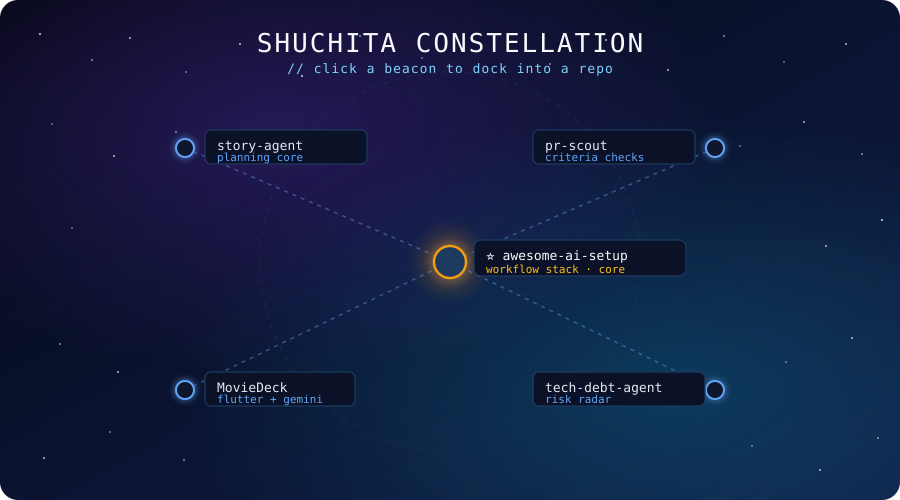
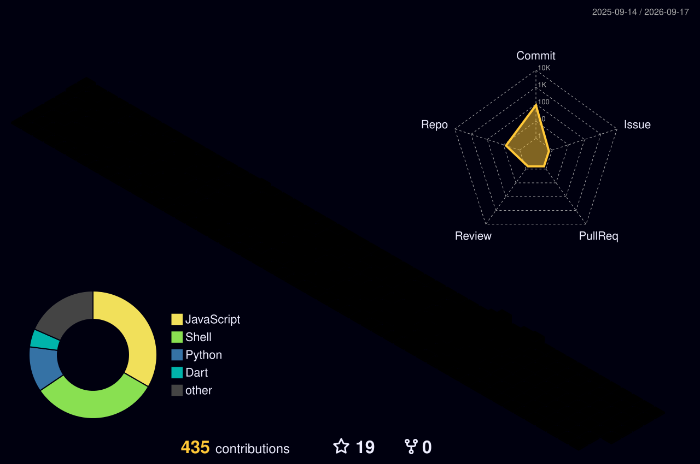

<div align="center">

<picture>
	<source media="(prefers-color-scheme: dark)" srcset="./assets/hero-dark.svg" />
	<source media="(prefers-color-scheme: light)" srcset="./assets/hero-light.svg" />
	
</picture>


[](https://linkedin.com/in/shuchita-jain)
[](https://medium.com/@coderSJ)
[](https://github.com/shuchitajain)

</div>

## Current Mission

```dart
const shuchita = Engineer(
  experience: '4 years Flutter in production',
  focus: [
    'offline-first architecture',
    'agent workflows for real delivery pipelines',
    'context engineering',
  ],
  mobileStack: ['Flutter', 'Dart', 'Firebase', 'SDUI', 'offline-first architecture'],
  aiStack: ['agent orchestration', 'CI-grade acceptance gates', 'MCP'],
  currentBuild: 'story-agent, planning core for AI-augmented delivery',
  writingAt: 'medium.com/@coderSJ',
  mode: 'planning-first, measurable outcomes, architecture before automation',
);
```

<div align="center">


</div>

## Flagship: Story Agent

**[story-agent](https://github.com/shuchitajain/story-agent)** is the anchor project. A planning agent that converts raw user stories into scoped, testable delivery tasks, built around the constraints that show up in real production teams: partial context, shifting specs, and humans who need to stay in the loop.

<div align="center">

[](https://github.com/shuchitajain/story-agent)

</div>

## Project Constellation

<div align="center">
	<a href="https://github.com/shuchitajain?tab=repositories">
		
	</a>
</div>

<map name="project-atlas-map">
	<area shape="circle" coords="486,283,18" href="https://github.com/shuchitajain/awesome-ai-setup" alt="awesome-ai-setup" title="⭐ awesome-ai-setup, workflow stack" />
	<area shape="circle" coords="200,160,12" href="https://github.com/shuchitajain/story-agent" alt="story-agent" title="story-agent, planning core" />
	<area shape="circle" coords="772,160,12" href="https://github.com/shuchitajain/pr-scout" alt="pr-scout" title="pr-scout, criteria checks" />
	<area shape="circle" coords="200,421,12" href="https://github.com/shuchitajain/MovieDeck" alt="MovieDeck" title="MovieDeck, Flutter + Gemini" />
	<area shape="circle" coords="772,421,12" href="https://github.com/shuchitajain/tech-debt-agent" alt="tech-debt-agent" title="tech-debt-agent, risk radar" />
</map>

Fallback docking index:

- Center ⭐ → [awesome-ai-setup](https://github.com/shuchitajain/awesome-ai-setup)
- Top Left → [story-agent](https://github.com/shuchitajain/story-agent)
- Top Right → [pr-scout](https://github.com/shuchitajain/pr-scout)
- Bottom Left → [MovieDeck](https://github.com/shuchitajain/MovieDeck)
- Bottom Right → [tech-debt-agent](https://github.com/shuchitajain/tech-debt-agent)

## Writing

<table>
<tr>
<td valign="top" width="65%">

<table>
<tr>
<td width="50%" valign="top">
<a href="https://medium.com/@coderSJ/your-ai-isnt-getting-dumber-your-session-is-getting-dirtier-8a2a02def98e">

<br/><strong>Your AI Isn't Getting Dumber.<br/>Your Session Is Getting Dirtier.</strong>
</a>
</td>
<td width="50%" valign="top">
<a href="https://medium.com/@coderSJ/ai-wont-replace-flutter-developers-the-devs-across-the-table-will-c2eb72768564">

<br/><strong>AI Won't Replace Flutter Developers.<br/>The Devs Across The Table Will.</strong>
</a>
</td>
</tr>
<tr><td colspan="2"><br/></td></tr>
<tr>
<td width="50%" valign="top">
<a href="https://medium.com/@coderSJ/google-just-reinvented-server-driven-ui-mind-the-scars-117ad94c39cf">

<br/><strong>Google's A2UI Is SDUI With an LLM.<br/>Mind the Scars.</strong>
</a>
</td>
<td width="50%" valign="top">
<a href="https://medium.com/@coderSJ/the-sdk-tax-a-bill-you-pay-in-outages-not-invoices-ecb4a4a8eb3f">

<br/><strong>The SDK Tax: A Bill You Pay<br/>In Outages, Not Invoices.</strong>
</a>
</td>
</tr>
</table>

</td>
<td valign="middle" align="center" width="35%">
	
</td>
</tr>
</table>


## Active Research

<table>
<tr>
<td width="33%" valign="top">

⚙️ **Agent Infrastructure**
<p>Agents forget. They drift. They confidently act on context that stopped being true three tool calls ago. What does it actually take to keep one coherent?</p>

</td>
<td width="33%" valign="top">

🛡️ **Safety & Governance**
<p>The scariest prompt injections don't look like attacks. They look like normal user input. Where do you even draw the line, and who enforces it?</p>

</td>
<td width="33%" valign="top">

🔭 **Agent Observability**
<p>If your agent makes a bad call at 2am, can you reconstruct exactly what it saw, what it decided, and what it cost? Most setups can't.</p>

</td>
</tr>
<tr>
<td width="33%" valign="top">

🧠 **Codebase Intelligence**
<p>A codebase isn't a document. It's a set of decisions made by people who've since left. Getting an agent to understand that, without reading everything, is the unsolved part.</p>

</td>
<td width="33%" valign="top">

🚀 **AI-Augmented Delivery**
<p>Adding an agent to a team is easy. Not breaking the team's existing trust and review culture while doing it, that's the part nobody writes about.</p>

</td>
<td width="33%" valign="top">

📱 **Mobile × AI**
<p>Mobile apps have hard constraints: offline states, small screens, slow networks. Most AI tooling ignores all of that. What changes when it can't?</p>

</td>
</tr>
</table>

## GitHub Signals

<div align="center">
	
</div>
